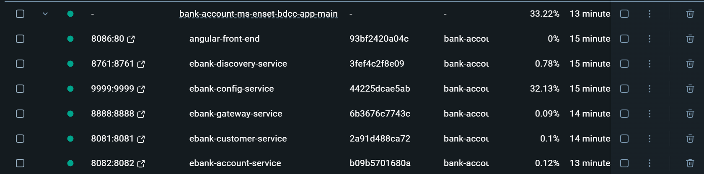
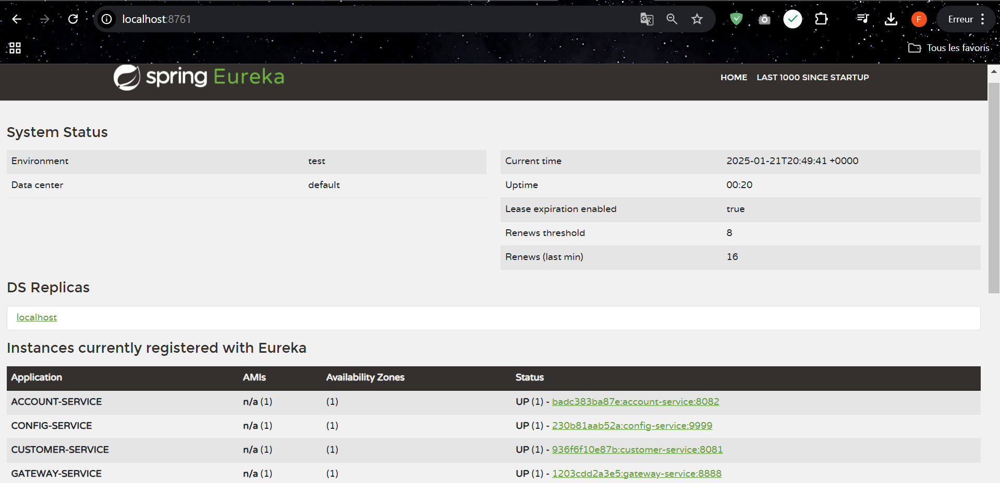
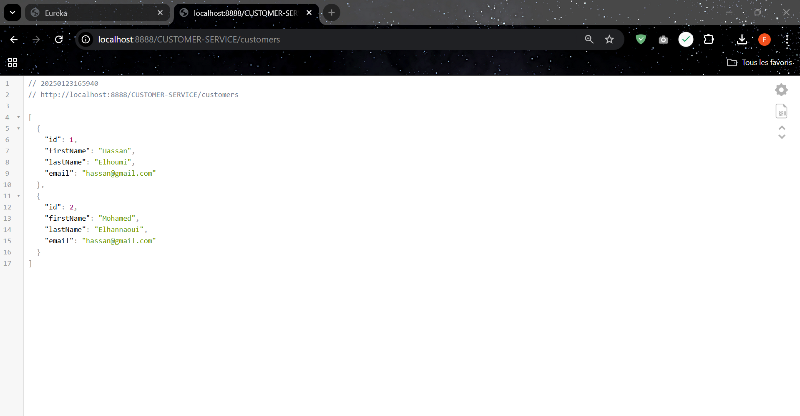
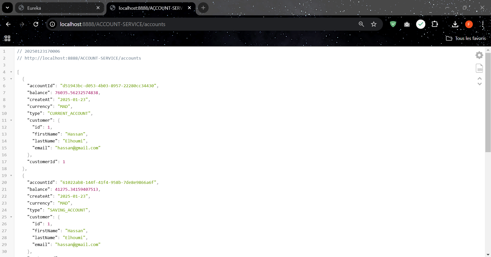
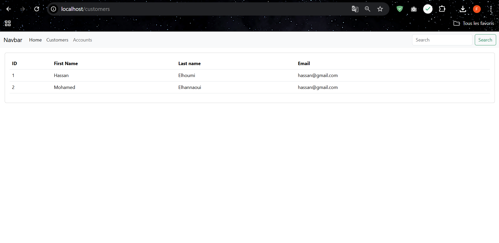
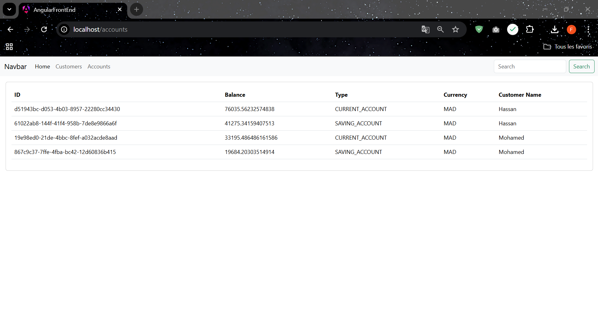

# DOCKERIZED MICROSERVICE APPLICATIONS

* Link to config repo : https://github.com/fouad-saidi-dev/bank-account-config-repo

## DOCKERIZED APPLICATIONS

## EUREKA SERVER

## CUSTOMER SERVICE

## ACCOUNT SERVICE

## ANGULAR FRONT END

